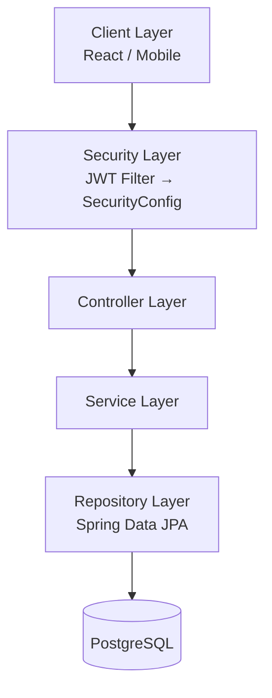
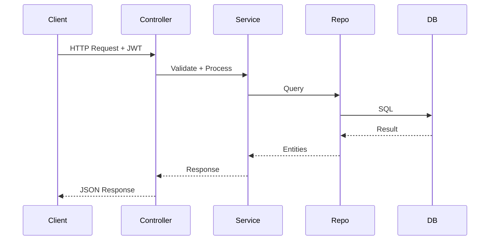
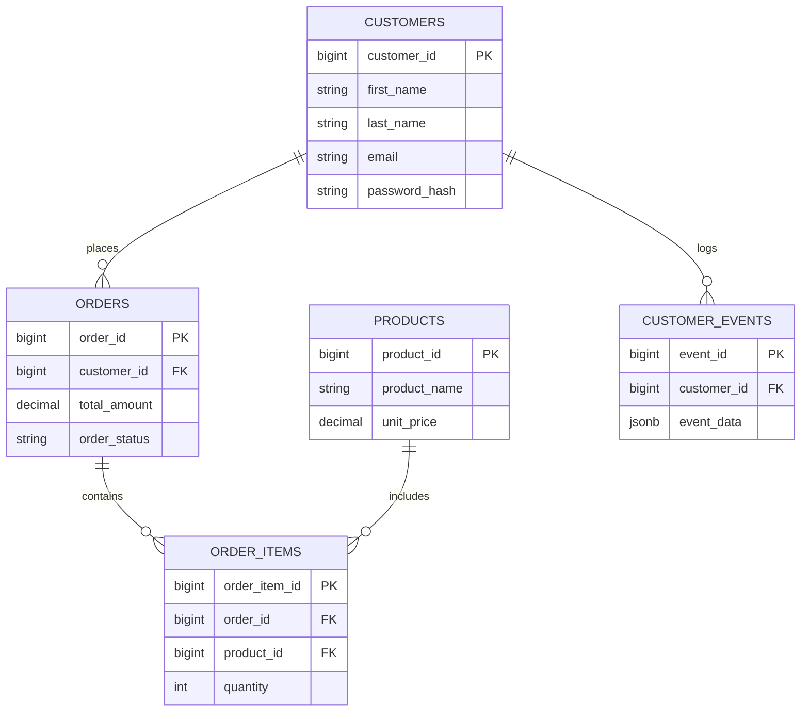

# Retail Shopping API

A production-ready Spring Boot 3 REST API for retail shopping with JWT authentication, product catalog, customer events, and order management.

<p align="left">
  
  
  
  
  
  
  
</p>

## Architecture



## Tech Stack

- **Java 17+**
- **Spring Boot 3.x**
- **Spring Security** (JWT)
- **Spring Data JPA** (Hibernate)
- **PostgreSQL** / H2
- **Lombok**
- **JaCoCo**
- **Swagger / OpenAPI**

## Prerequisites

- Java 17
- Maven 3.8+
- PostgreSQL 15+
- (Optional) Docker

## Environment Variables

`.env`:

```bash
RETAIL_JWT_SECRET=your-secret-key-min-32-characters
```

## Configuration

`src/main/resources/application.yaml`

```yaml
spring:
  datasource:
    url: jdbc:postgresql://localhost:5432/retaildb
    username: your_username
    password: your_password

  jpa:
    hibernate:
      ddl-auto: update

jwt:
  secret: ${RETAIL_JWT_SECRET}
  expiration: 86400000
```

## Running the Application

### Maven

```bash
mvn clean install
mvn spring-boot:run "-Dspring-boot.run.profiles=local"
```

### Docker Support

**Dockerfile**

```dockerfile
FROM eclipse-temurin:17-jdk
WORKDIR /app
COPY target/retailshopping.jar app.jar
ENTRYPOINT ["java","-jar","/app/app.jar"]
```

**docker-compose.yaml**

```yaml
version: '3.8'

services:
  retail-api:
    build: .
    ports:
      - "8080:8080"
    environment:
      RETAIL_JWT_SECRET: your-secret-key-min-32
      SPRING_DATASOURCE_URL: jdbc:postgresql://db:5432/retaildb
      SPRING_DATASOURCE_USERNAME: postgres
      SPRING_DATASOURCE_PASSWORD: postgres
    depends_on:
      - db

  db:
    image: postgres:15
    environment:
      POSTGRES_DB: retaildb
      POSTGRES_USER: postgres
      POSTGRES_PASSWORD: postgres
    ports:
      - "5432:5432"
```

Run:

```bash
docker-compose up --build
```

## API Endpoints

### Authentication

| Method | Endpoint | Description | Auth |
|--------|----------|-------------|------|
| POST | `/api/auth/register` | Register new customer | No |
| POST | `/api/auth/login` | Login & get JWT | No |
| GET | `/api/auth/me` | Current logged-in user | Yes |

### Customers

| Method | Endpoint | Description | Auth |
|--------|----------|-------------|------|
| GET | `/api/customers` | Search customers | Yes |
| POST | `/api/customers` | Create customer | No |
| GET | `/api/customers/{id}` | Get customer details | Yes |
| GET | `/api/customers/{id}/events` | Customer events | Yes |

### Orders

| Method | Endpoint | Description | Auth |
|--------|----------|-------------|------|
| POST | `/api/orders/checkout` | Place an order | Yes |
| GET | `/api/orders/customer/{customerId}` | Get orders for customer | Yes |

### Events

| Method | Endpoint | Description | Auth |
|--------|----------|-------------|------|
| POST | `/api/events` | Log customer event | Yes |
| GET | `/api/events/customer/{customerId}` | Get customer events | Yes |

### Products

| Method | Endpoint | Description | Auth |
|--------|----------|-------------|------|
| GET | `/api/products` | List all products | No |
| GET | `/api/products/search?query=` | Search products | No |

## Example Requests

### Login

**Request**

```json
{
  "email": "john@example.com",
  "password": "password123"
}
```

**Response**

```json
{
  "token": "eyJhbGciOiJIUzI1NiIsIn..."
}
```

### Checkout Order

```json
{
  "customerId": 1,
  "items": [
    {"productId": 100, "quantity": 2},
    {"productId": 101, "quantity": 1}
  ],
  "paymentMethod": "CREDIT_CARD",
  "shippingAddress": "123 Market St"
}
```

## Request Lifecycle



## Database ERD



## Testing

```bash
mvn clean test
mvn clean test jacoco:report
```

Coverage report: `target/site/jacoco/index.html`

## Postman Collection

```json
{
  "info": {
    "name": "Retail Shopping API",
    "schema": "https://schema.getpostman.com/json/collection/v2.1.0/collection.json"
  },
  "item": [
    {
      "name": "Login",
      "request": {
        "method": "POST",
        "url": "{{base_url}}/api/auth/login",
        "body": {
          "mode": "raw",
          "raw": "{\n  \"email\": \"john@example.com\",\n  \"password\": \"password123\"\n}"
        }
      }
    },
    {
      "name": "Get Products",
      "request": {
        "method": "GET",
        "url": "{{base_url}}/api/products"
      }
    }
  ]
}
```

Postman environment variable: `base_url = http://localhost:8080`

## Project Structure

```
src/
├── main/java/com/retailcorp/retailshopping/
│   ├── config/
│   ├── controller/
│   ├── dto/
│   ├── entity/
│   ├── exception/
│   ├── repository/
│   ├── service/
│   └── util/
└── test/java/com/retailcorp/retailshopping/
    ├── integration/
    └── unit/
```

## Contributing

1. Fork the repo
2. Create your feature branch: `git checkout -b feature/my-feature`
3. Commit changes: `git commit -m "Add feature"`
4. Push: `git push origin feature/my-feature`
5. Open a Pull Request

## Versioning

Semantic Versioning (SemVer): `MAJOR.MINOR.PATCH`

## License

MIT License © RetailCorp